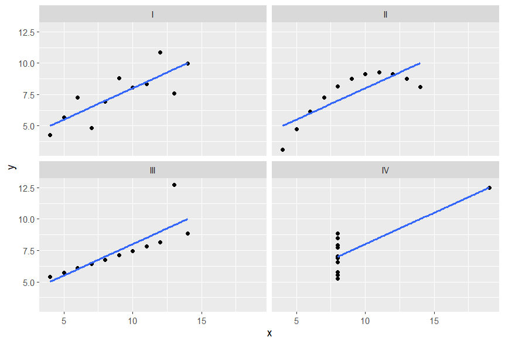

__________________________________________________________________________
Four datasets that have nearly identical summary statistics. 

We can see an example of Anscombe's quartet using the 'Tmisc' package made by [Stephen Turner](https://github.com/stephenturner) so the 'Tmisc' stands for "Turner Miscellaneous" which contains miscellaneous utility functions for data manipulation, data tidying and working with gene expression data.

```r
install.packages("Tmisc")
library("Tmisc")
```

Now let's load the quartet dataset.
```r
data("quartet")
View(quartet)
```

In the view of our dataset we can observe that there are four sets contained in it. We will now group our data by these sets, and summarize them using the **mean** and **standard deviation** of both X and Y variable, and also the **correlation** between these two variables.

```r
library(tidyverse) # for using the summarize function

quarted |> group_by(set) |> summarize(mean(x), sd(x), mean(y), sd(y), cor(x, y))
```

Output:
```
set   `mean(x)` `sd(x)` `mean(y)` `sd(y)` `cor(x, y)`
  <fct>     <dbl>   <dbl>     <dbl>   <dbl>       <dbl>
1 I             9    3.32      7.50    2.03       0.816
2 II            9    3.32      7.50    2.03       0.816
3 III           9    3.32      7.5     2.03       0.816
4 IV            9    3.32      7.50    2.03       0.817
```

The mean was calculated using the **mean()** function, the standard deviation was calculated using the **sd()** function, and finally, the correlation between the variable was calculated using the **cor()** function.

#### Observations

Just by looking at the summary of the four sets, we may assume that the data is identical. But, sometimes, just looking at the summarize data can be misleading.

These sets are in-fact quite different from each other. Let's see this using a visualization.

```r
quartet |> ggplot(aes(x, y)) + geom_point() + geom_smooth(method = "lm", se = FALSE) + facet_wrap(~set)
```

 
